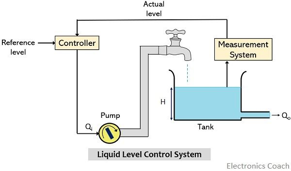
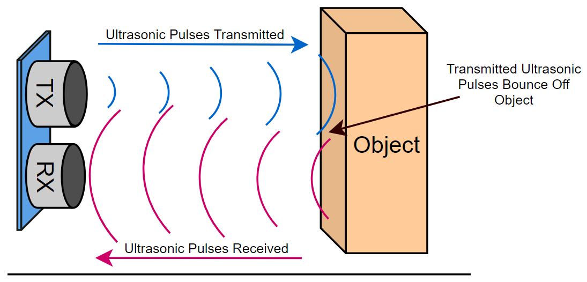
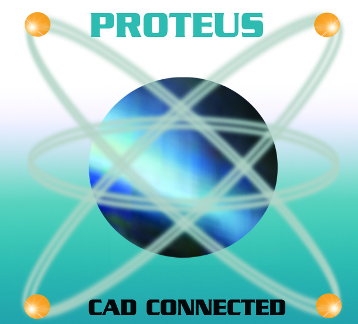
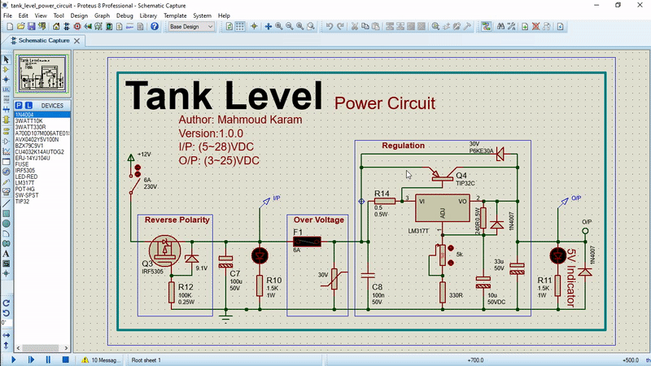
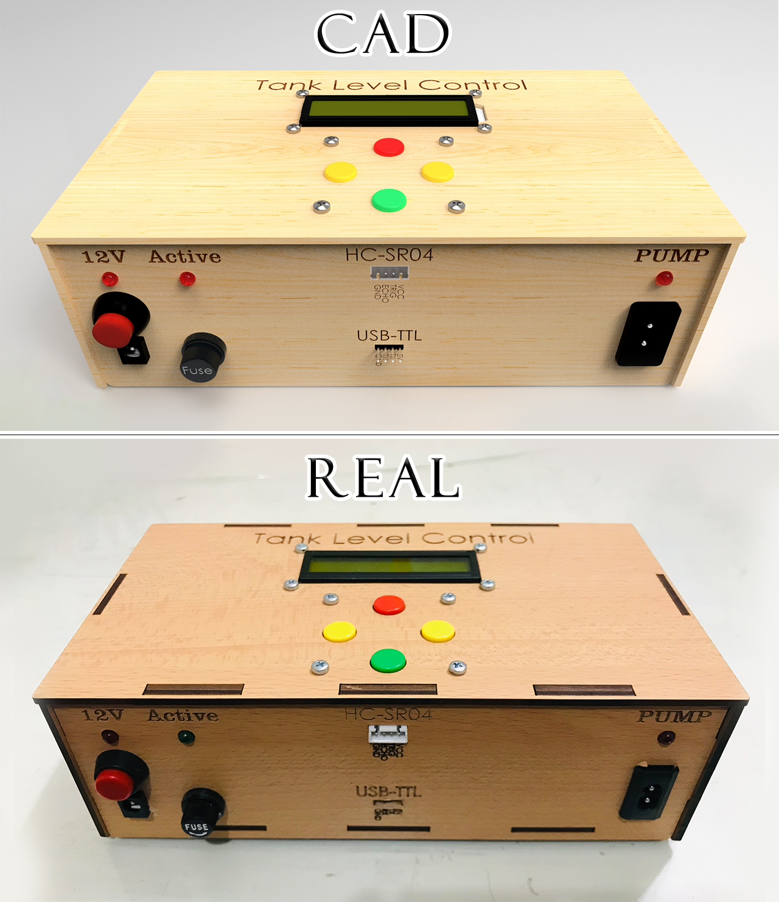
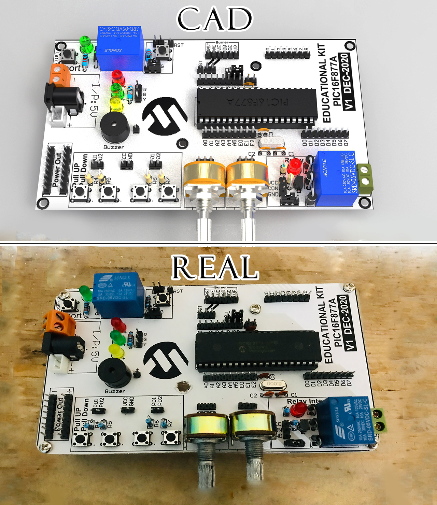
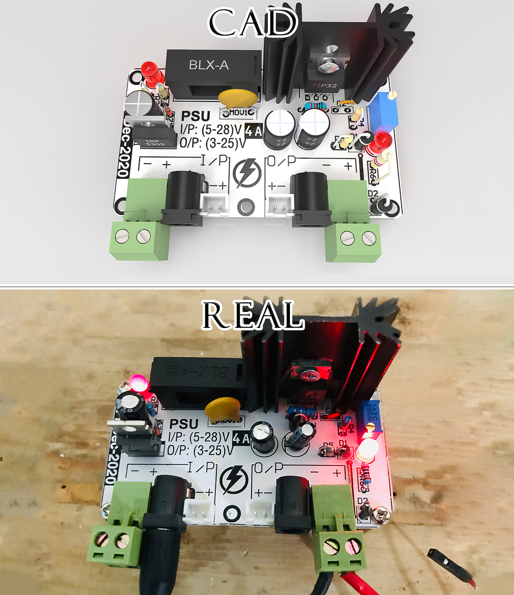
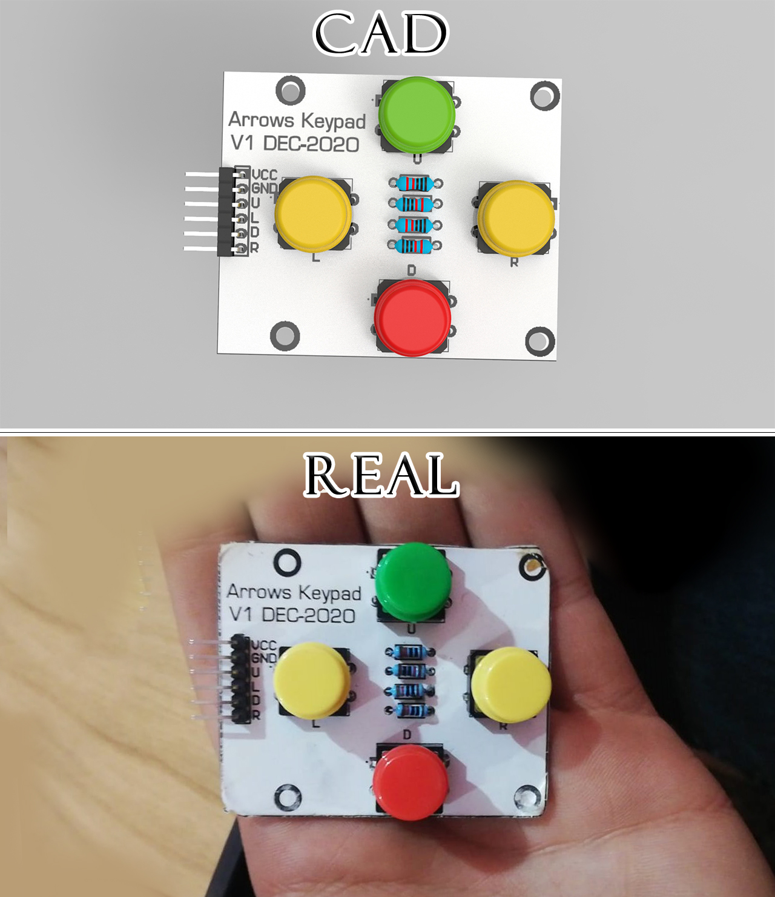

<h1 align="center">Tank Level Control</h1>

      

<p align="center">

</p>

This is the render of the final product.

---

<!-- @import "[TOC]" {cmd="toc" depthFrom=1 depthTo=6 orderedList=false} -->

<!-- code_chunk_output -->
## Table of Contents

- [🔑 Introduction](#introduction)
- [🧮 Block Diagram](#block-diagram)
- [➗ Calculations of Distance](#calculations-of-distance)
- [🛠️ Development Tools Required](#️-development-tools-required)
- [🗻 Project Hierarchy](#project-hierarchy)
- [⚙ Working](#working)
  - [Code](#code)
  - [Simulation](#simulation)
- [📑 Generate Documentation](#generate-documentation)
- [🏭 Manufacturing](#manufacturing)
- [🎯 Results](#results)
- [🔬 What is next?](#what-is-next)
- [💁‍♂️ Contribute](#️-contribute)
- [📞 Contact me](#contact-me)
- [📖 References](#references)
- [🔓 Licenses](#licenses)
- [🔏 Credits](#credits)

<!-- /code_chunk_output -->

---

## 🔑 Introduction

Tank Level Control System is a system designed to monitor and control the level of a fluid in a tank.

If the tank gets empty and filled periodically such as in **Residential Buildings** as shown in the image below.
It will be a boring task to get a human to monitor the tank. Also, human problems such as quick response is always slower than automation system. So, the automation system is the best solution for this problem.

<p align="center">

</p>

It has many applications such:

1. Process tank: An important function.
2. Hot water tank: Water is removed, perhaps for washing down, and the level needs to be restored ready for the next wash cycle.

---

## 🧮 Block Diagram

<p align="center">
  
</p>

The main components of the system are:

1. **Fluid tank**: Used to hold the desired amount of fluid.
2. **Measurement system**: Senses the level of the fluid inside the tank.
3. **Controller**: Used to maintain the desired level by starting and stopping the pump depending on the information from the measurement system.
4. **Pump**: Feeds water from the source to the tank when actuated by the controller.

---

## ➗ Calculations of Distance

With the ultrasonic sensor, it sends ultrasonic waves which get beack to the sensor when hitting any surface (e.g., liquid in our case). The distance between the sensor and the surface is calculated by the following formula:

We can calculate the distance between the sensor and the surface as follows:

1. Calculate the time consumed from the instanse of sending the waves to the instance of recieving it using a timer inside the microcontroller.
2. As long as the ultrasonic waves are in fact sound waves. So, the speed of ultrasonic waves equals the speed of sound = **343 m/s**.
3. The distance between the sensor and the surface is:
   ```Distance = Speed * (Time / 2)```

4. Why the distance is divided by 2?
   The distance is divided by 2 because the waves go to the surface, then back to the sensor. So, the time calculated is the time it takes to go from the sensor to the surface and back to the sensor, hence the time must be divided by 2.

<p align="center">
  
</p>

---

## 🛠️ Development Tools Required

- **Toolchain**: MikroC Pro 

  MikroC Pro is used for code development and compiling the system.
  
  Website: [www.mikroe.com](http://www.mikroe.com/)

- **Text Editor**: <u>Visual Studio Code</u> 
  
  VS Code is used for code development. It is **free**.
  
  Download: [https://code.visualstudio.com/](https://code.visualstudio.com/)
  
- **Hardware Simulator**: <u>Proteus 8.9</u> 
  
  Proteus is used to simulate the hardware. So, no need to purchase any hardware.
  
  Download: [https://www.proteus.co.jp/](https://www.proteus.co.jp/)

- **Mechanical Design Software**: <u>SolidWorks</u> 

  Website: [https://www.solidworks.com/](https://www.solidworks.com/)

- **PCB Design Software**: <u>Altium Designer</u> 

  Website: [https://www.altium.com/](https://www.altium.com/)

- **Documents Generator**: <u>doxygen</u> 
  
  Doxygen is used to generate documentations of the code in html, latex, pdf, and other formats.
  
  Download: [https://www.doxygen.nl/download.html](https://www.doxygen.nl/download.html)

- **Command Line Automation Tool**: <u>make</u> 
  
  Make is used to automate kernel commands.
  I've used it to automate the generation of documents from doxygen.
  
  Download:
  - Linux or MacOS: [https://www.gnu.org/software/make/](https://www.gnu.org/software/make/)
  - Windows: [http://gnuwin32.sourceforge.net/packages/make.htm](http://gnuwin32.sourceforge.net/packages/make.htm)

---

## 🗻 Project Hierarchy

The project contains some files and directories:

- **[electrical](electrical/)**: Contains everything about the electrical circuit.
  
  - [pcb](electrical/pcb): Contains PCB design of all electronics boards used in this project.
  - [simulation](electrical/simulation)**: Contains simulation files of all electronics boards used in this project.
  - [resources](electrical/resources): Contains all resources used while designing circuits.
  - [docs](electrical/docs): Contains videos of testing circuits, photos of circuits, and the pdf files describing the circuits.
  - [store_bills](electrical/store_bills): Contains store bills of components purchased for the project.
  - [bill_of_material.xlsx](electrical/bill_of_material.xlsx): Contains bill of material of components purchased for the project.
  - [version_edits.txt](electrical/version_edits.txt): Contains all bugs of the electronic circuits in the current version. So, they need to be fixed in the next version.

- **[mechanical](mechanical/)**: Contains everything about the mechanical design (Enclosure).
  - [box](mechanical/box): Contains the mechanical design of the enclosure using Solidworks.
  - [attachments](mechanical/attachments): Contains the external parts downloaded from the internet to incoroporate in the final assembly enclosure using Solidworks in the file [assembly.SLDASM](mechanical/assembly.SLDASM).
  - [arrows_keypad](mechanical/arrows_keypad), [control_circuit](mechanical/control_circuit), and [power_circuit](mechanical/power_circuit): Step files of the electronics circuits [here](electrical/simulation), to incoroporate in the final assembly enclosure using Solidworks in the file [assembly.SLDASM](mechanical/assembly.SLDASM).
  - [assembly.SLDASM](mechanical/assembly.SLDASM): Contains the final assembly of the projects containing enclosure, electronic circuits, and attachments.
  - [assembly_drawing.SLDDRW](mechanical/assembly_drawing.SLDDRW): Contains the drawing file generated by Solidworks for the assembly.
  - [final_assembly.PDF](mechanical/docs/final_assembly.PDF): Contains dimension, and different views of the assembly. It is generated from the file [final_assembly.PDF](mechanical/docs/final_assembly.PDF).

- **[software](software/)**: Contains everything about the code.
  - [code](software/code): Contains the code of the project.
  - [resources](electrical/resources): Contains all resources used while designing circuits.
  - [problems.txt](software/problems.txt): Contains documentation of some problems occuredd while testing the system physically.
  - [version_edits.txt](software/version_edits.txt): Contains all bugs of the code in the current version. So, they need to be fixed in the next version.

- **[docs](docs/)**: Contains the documentation generated using doxygen and make, and other documents designed by me.
- **[README.md](README.md)**: Contains the introduction of the project (What you are reading now).
- **[LICENSE](LICENSE)**: Contains the license of the project.
- **[Doxyfile](Doxyfile)**: Contains the configuration of doxygen (Documentation generator).
- **[doxygen.mk](doxygen.mk)**: Contains the configuration and rules to be run using make to generate documents.
- **[Makefile](Makefile)**: Contains the configuration and rules to be run using make to automate buil process of the software (compile, flash, clean, ...) documents.
- **[steps_of_project.pdf](steps_of_project.pdf)**: Contains the block diagram of steps of the project.

---

## ⚙ Working

### Code

To develop the project (code), you need to:

- YOU MUST HAVE **(MikroC Pro) or (Visual Studio Code with XC8 PIC Compiler)** installed on your computer.
- Open the [code](software/code) directory.
- If you have:
  - MikroC Pro: Click twice on **[tankLevel.mcppi](tankLevel.mcppi)** file. It will open with Mikro C Pro.
  - Visual Studio Code with XC8 compiler: Open the project with VS Code.
- Enjoy the development.
- To build the project, if you have:
  - MikroC Pro: Click on **Build button** on quick access bar of MikroC Pro, or press **Ctrl + F9** on the keyboard.
  - Visual Studio Code with XC8 compiler:
    - Open the terminal inside VS Code by pressing on **Ctrl + `** on the keyboard.
    - Type the command ```make all```. It will compile the project.
    - The hex file will be generated in the [code](software/code) directory with the name **app.hex**.
    - To flash the hex file to the PIC, type the command ```make flash```.
    - To remove the output files (hex and intermediate files), type the command ```make clean```.

**NOTE**: I've documented the code as much as I can. So, I hope you will understand the code.

### Simulation

To simulate the project, you need to:

- YOU MUST HAVE **Proteus** installed on your computer.
- Proteus has **compatibility issues** with its version, and the project may not be opened if you have a different version of proteus. So, you need to install **Proteus 8.9** to be able to simulate the project.
- From the [simulation](electrical/simulation) directory, open the folder of any of the boards.
- Click twice on the file ends with **[.pdsprj](simulation/simulation.pdsprj)**.
- It will open with Proteus as shown here:
  - Control Circuit
   
  - Power Circuit
   

- As shown in the Control Circuit, it is divided into blocks such as Controller, PUMP, and Sensor blocks.

- To run simulation, click on **F12** from the keyboard.
- Increase/Decrease the distance measured by the ultrasoni sensor by pressing Up/Down arrow on the Sensor block. The distance measured by the sensor will be displayed on the LCD screen as a percentage representing the level percentage of the tank. The percentage depends on a predetermined value equals to the height of the tank (in our case, the tank is 24cm height).
- When the percentage is lower than 15%, the pump will be turned on.
- When the percentage is higher than 80%, the pump will be turned off.
- When the percentage is between 15% and 80%, the pump will be latched to the last state. If the pump was on, it will be remains on. If the pump is off, it will remains off.
- To stop the simulation: Press twice on **ESC** key from the keyboard.

**NOTE**: The keypad is not used in the current version of the project. It is put for future use.

---

## 📑 Generate Documentation

To generate documentation:

1. YOU MUST HAVE **DOXYGEN** AND **MAKE** INSTALLED ON YOUR COMPUTER.
2. From the home directory of the project (**tank_level_control**), open the command prompt in your OS (**cmd** for Windows, **bash** for linux, ...)
3. Run the following command:
   ```make -f doxygen.mk all```
4. The documentation will be generated in the **[docs](docs)** directory.

---

## 🏭 Manufacturing

**Here is a comparison between CAD design on Solidworks versus the final physical shape:
**

1. Product:

  
2. Control Circuit:

  
3. Power Circuit:

  
4. Keypad:

  

---

## 🎯 Results

After running the project either on the simulation (Proteus) or running the physical hardware. The result was as expected. So, you also can use the project and it will work as expected.

You can check the working of the project by opening the [test_project.m4v](electrical/docs/test_videos/test_project.m4v) file.

If you want to check operation of each circuit, open:

- [test_power_circuit.m4v](electrical/docs/test_videos/test_power_circuit.m4v) to see the working of power circuit.
- [test_kit.m4v](electrical/docs/test_videos/test_kit.m4v) to see the working of control circuit.
- [test_short_circuit.m4v](electrical/docs/test_videos/test_short_circuit.m4v) to see the working of short circuit protection.

---

## 🔬 What is next?

I will always try to improve this project.
***Next Version***: Features of the next version can be found in the file [version_edits.txt](software/version_edits.txt) in [software](software/) directory.

---

## 💁‍♂️ Contribute

If you want to contribute to the project, you can:

1. Fork the project on your GitHub account.
2. Develop the project on your own.
3. Send a pull request to the project on GitHub.
4. I will review your pull request and add it to the project.

---

## 📞 Contact me

<p><a href="https://www.linkedin.com/in/makaram99" target="_blank"></a> <a href="mailto:ma.karam272@gmail.com" target="_blank"></a> </p>

---

## 📖 References

- Resources used can be found in resources directories inside [software](software/), [mechanical](mechanical/), and [electrical](electrical/) directories.

---

## 🔓 Licenses

<a rel="license" href="http://creativecommons.org/licenses/by-sa/4.0/"></a><br />All DOCUMENTS inside this work is licensed under a <a rel="license" href="http://creativecommons.org/licenses/by-sa/4.0/">Creative Commons Attribution-ShareAlike 4.0 International License</a>.

All SOURCE codes & BINARIES are licensed under Mit License.

<p align="center">
  
</p>

<p align="center">
  
</p>

---

## 🔏 Credits

All credits and external sources are listed inside the page and inside this repo, references themselves.
