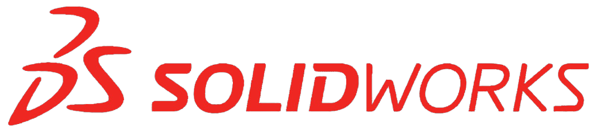

<h1 align="center">Tank Level Control</h1>

       

<p align="center">
  
</p>
This is the render of the final product.

## Liquid Level Control System
It is a system designed to control the level of fluid in a tank. 

The main purpose of these systems is to control the flow of the fluid so it can reach the desired level.

## Components
The main components of the system are:
1. **Fluid tank**: Used to hold the desired amount of fluid.
2. **Measurement system**: Senses the level of the fluid inside the tank.
3. **Controller**: Used to maintain the desired level by starting and stopping the pump depending on the information from the measurement system.
4. **Pump**: Feeds water from the source to the tank when actuated by the controller.

<p align="center">
  
</p>

---
## Why AUTOMATION?
If the tank gets empty and filled periodically and should always be filled. It is a boring task to get a human to monitor the tank. Also, the human response is always slower than automation syste. All of the human problems exists.

---
## Applications
It has many applications such:
1. Process tank: An important function. 
2. Hot water tank: Water is removed, perhaps for washing down, and the level needs to be restored ready for the next wash cycle.

Many different types of level control systems are used in industry, covering a wide range of processes and not liquids such as: 
1. Dry powders.
2. Chemical feedstock.

## Measurement System
Many systems are available to serve this wide range of applications. To see all types, refer to this [article](https://www.spiraxsarco.com/learn-about-steam/control-applications/level-control-applications).

In this project, we used an **Ultrasonic sensor** for measurement.

## Calculations of Distance
With the ultrasonic sensor, it sends ultrasonic waves which get beack to the sensor when it hits any surface (e.g., liquid in our case). We can calculate the time consumed from the instanse of sending the waves to the instance of recieving it. knowing the speed of sound = 343 m/s, we can calculate the distance as follow:
```
Distance = Speed * Time
```

---
## Technical progress
The project consists of:
1. SW 
2. Electrical
3. Mechanical

### SOFTWARE
SW tools used: [](https://www.mikroe.com/mikroc-pic) 

Platform used: [PIC16F877A](https://www.microchip.com/en-us/product/PIC16F877A) 

***Responsibilities***:
   * SW design.

***Work***: can be found in this [folder](technical/software/)

***Next Version***: Features of the next version can be found in file [versionEdits.txt](technical/software/versionEdits.txt) inside software directory.

***
### ELECTRICAL
***Responsibilities***
   * Pump selection.
   * Electrical design of circuits.
   * PCB design.
   * Power System.
   * etc.

***Work***: can be found in this [folder](technical/electrical/)

***Next Version***: Next version modifications of each PCB can be found in file [versionEdits.txt](technical/electrical/circuits/versionEdits.txt) inside electrical directory.

Here are the Boards designed and manufactured:

1. Control Circuit:
   
   
2. Power Circuit:
   
   
3. Keypad:
   
   
   
***
### MECHANICAL
SW tools used: [](https://www.solidworks.com/)

***Responsibilities***
   * 3D design.
   * Manufacturing.

***Work***: can be found in this [folder](technical/mechanical/)

Here are some of the work:

1. Product:
   
    
   
2. Control Circuit:
   
    
3. Power Circuit:
   
   
4. Keypad:
   
   

---
## Support our efforts!

[](https://www.buymeacoffee.com/makaram99)

[Or leave a tip! ヾ(°∇°*)](https://www.paypal.me/kmahmoud633)

---
## Licenses
<a rel="license" href="http://creativecommons.org/licenses/by-sa/4.0/"></a><br />All DOCUMENTS inside this work is licensed under a <a rel="license" href="http://creativecommons.org/licenses/by-sa/4.0/">Creative Commons Attribution-ShareAlike 4.0 International License</a>.

All SOURCE codes & BINARIES are licensed under Apache.

<p align="center">
  

</p>

<p align="center">
  

</p>

---
## Credits
All credits and external sources are listed inside the page and inside this repo, references themselves.
