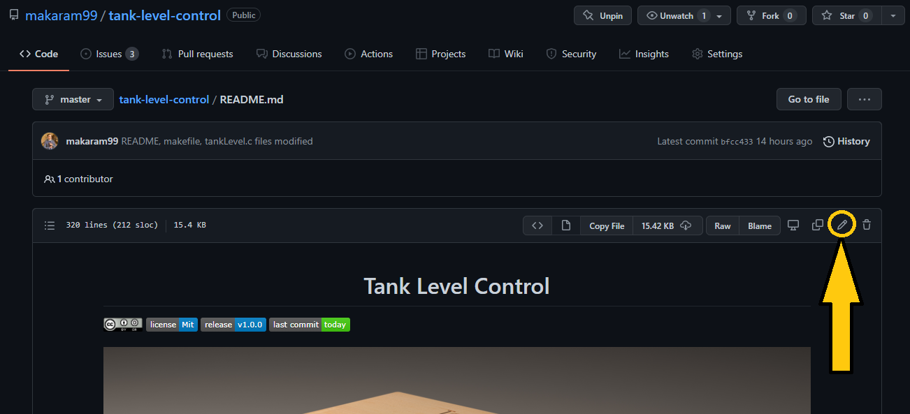

## Adding something to the project

If you have something awesome to contribute to the project, this is how you do it.

You'll need a [GitHub account](https://github.com/join)!

1. Access the project's GitHub page: [tank-level-control](https://github.com/makaram99/tank-level-control)
2. Click on the `README.md` file: 

3. Now click on the edit icon. 

4. You can start editing the text of the file in the in-browser editor. Make sure you follow guidelines above. You can use [GitHub Flavored Markdown](https://help.github.com/articles/github-flavored-markdown/). 

5. Say why you're proposing the changes, and then click on "Propose file change". 

6. Submit the [pull request](https://help.github.com/articles/using-pull-requests/)!

7. Wait for [pull request](https://help.github.com/articles/using-pull-requests/) review and merge.
8. Be proud that your changes are part of [tank-level-control](https://github.com/makaram99/tank-level-control) and you became a contributor to the project!

## Updating your Pull Request

Sometimes, a maintainer of an awesome list will ask you to edit your Pull Request before it is included. This is normally due to spelling errors or because your PR didn't match the awesome-* list guidelines.

[Here](https://github.com/RichardLitt/knowledge/blob/master/github/amending-a-commit-guide.md) is a write up on how to change a Pull Request, and the different ways you can do that.

[Here](https://www.youtube.com/playlist?list=PLoynTxuTLXaD8Hz_mLhYicC5BmpBwgSiK) is great introduction to Git and Github :heavy_exclamation_mark:

## References

This file would not exist without the [awesome-automotive](https://github.com/Marcin214/awesome-automotive) repository on GitHub.
